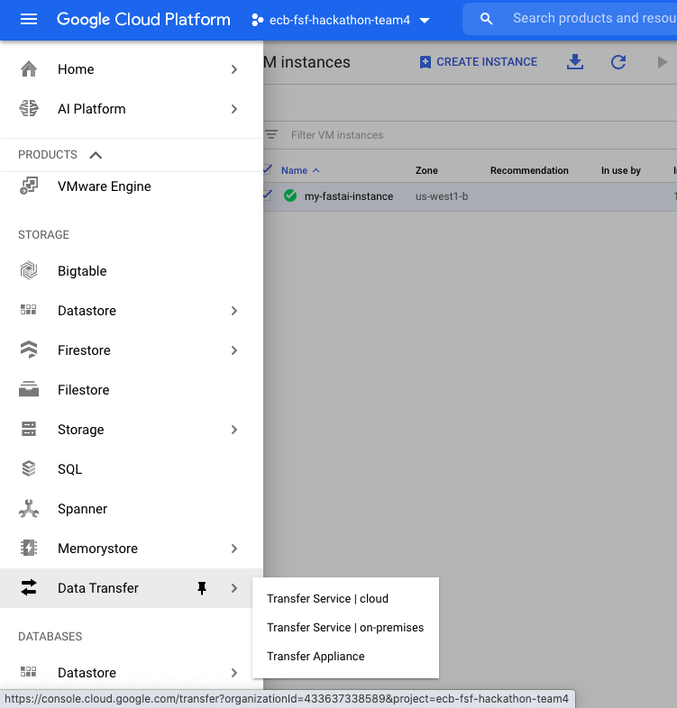

# Data Loading

The data for Eurex and Xetra is in AWS s3 containers, updated daily. 

Data Source: https://registry.opendata.aws/deutsche-boerse-pds/  
GitHub Repository: https://github.com/Deutsche-Boerse/dbg-pds

## Moving to Google Cloud

Since I have a GCP subscription, I want to move this data there. I will load the data in two stages: Day 0 loading of all historical data and a scheduler to load daily data. Thankfully, GCP provides this functionality. It's called **Data Transfer**. 

Go over there and Create a Transfer Job. 
