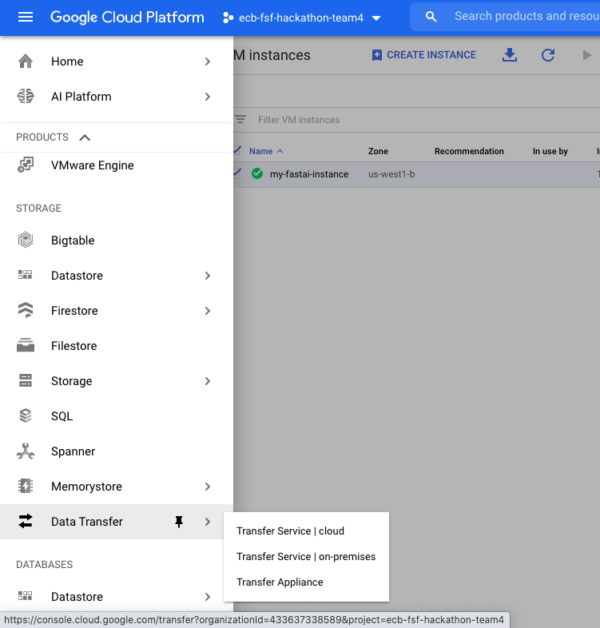

# Data Loading - GCP

The data for Eurex and Xetra is in AWS S3 containers, updated daily. I will outline the steps to load the Xetra data. The Eurex data can be loaded similarly. 

Data Source: https://registry.opendata.aws/deutsche-boerse-pds/ <br>
GitHub Repository: https://github.com/Deutsche-Boerse/dbg-pds

## Moving to Google Cloud

Since I have a GCP subscription, I want to move this data there. I will load the data in two stages: Day 0 loading of all historical data and a scheduler to load daily data. Thankfully, GCP provides this functionality. It's called **Data Transfer**. 



1. Go over there and Create a Transfer Job. 
2. Under *Select Source*, select Amazon S3 bucket. Next specify the name of the bucket. They can be found [here](https://github.com/Deutsche-Boerse/dbg-pds#locations). 


> You will need an AWS account to do the next step

3. Go to your AWS account, in [Security Credentials](https://console.aws.amazon.com/iam/home?#/security_credentials). 
4. Under `Access keys (access key ID and secret access key)`, select **Create New Access Key**. 
5. Enter this *Access key ID* and *Secret access key* and press Continue. 
6. Under *Select destination*, select your GCP cloud bucket. 
7. Finally configure the transfer. I recommend creating two jobs: one for 'Run Now' and one for 'Run Daily'. Repeat the steps above for creating the second job. 

This way, you have moved the data to your Google Cloud Bucket. 

## Using the data in GCP

1. Now start your GCP instance and create a project folder. Create a data folder inside it to retrieve the data we just loaded. 
```shell
mkdir -p data/deutsche-boerse-xetra-pds/
```
2. Next, we copy the data using `gsutil` to this folder. The name of your bucket can be found under *Destination bucket* in the list of your transfer jobs. 
```shell
gsutil cp -r gs://name-of-your-bucket/20* data/deutsche-boerse-xetra-pds/
```
 Now you have the data! 
 
 ## To-Dos
 
 - [ ] Automate loading everyday data by turning gsutil into a cron job on GCP. 
 - [ ] Load Eurex data. 
